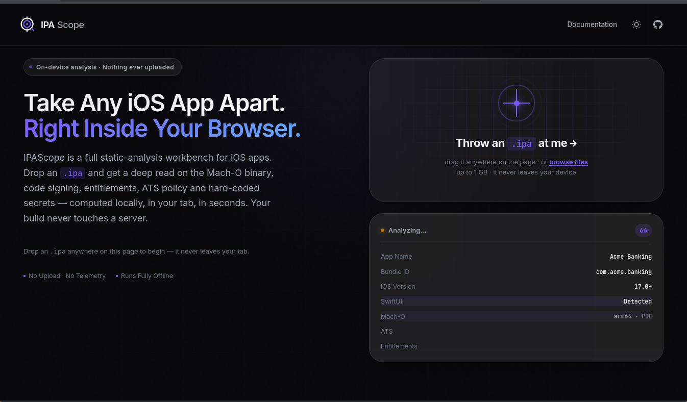
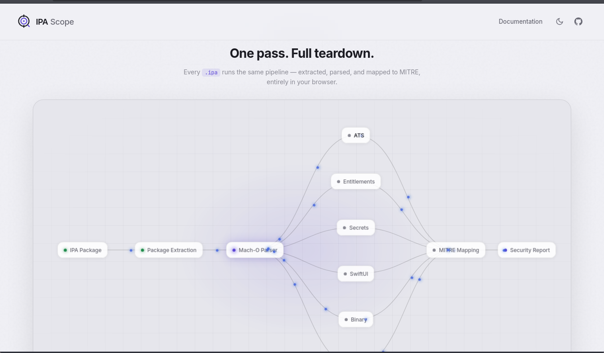

# IPAScope

iOS static security analysis that runs entirely in your browser. Drop an `.ipa` file and get a concise report — no backend required.

**Current release:** v0.5.0

Live: https://ipascope.vercel.app

## Screenshots

Dark theme



Light theme




## What it does

- Parses the app bundle and the Mach‑O executable to extract headers, flags and symbols.
- Extracts embedded provisioning profiles and entitlements and flags risky settings.
- Runs pattern‑based secret detection (vendor regexes + entropy gating) to reduce false positives.
- Performs ATS/TLS checks per domain and reports configuration risks.
- Exports reports in PDF, JSON, CSV and SARIF formats.


## Quick start

1) Open locally (no build step):

   - macOS: `open index.html`
   - Windows: `start index.html`
   - Linux: `xdg-open index.html`

2) Serve locally (recommended to enable the Web Worker):

```bash
python3 -m http.server 8000
# then visit http://localhost:8000
```

3) Deploy as a static site (GitHub Pages / Netlify / Cloudflare Pages).


## Notes

- Analysis runs entirely in the browser; nothing is uploaded to any server.
- On `file://` the Web Worker may fall back to main thread parsing.
- This is a fast, static first‑pass scanner — not a replacement for dynamic analysis.


## Contributing

- Open issues or PRs on GitHub. Keep changes focused and add tests where appropriate.


## Authors

Uday Shelke, Saurabh Sanmane & Omkar Naik


## License

MIT
